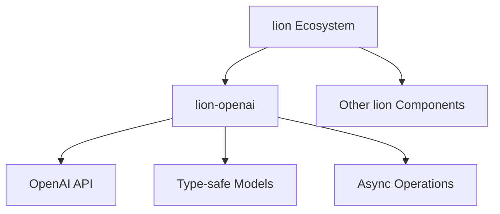

# 🦁 lion-openai

Welcome to lion-openai, a powerful Python library for seamless integration with OpenAI's APIs. As part of the lion ecosystem, lion-openai provides a robust, type-safe, and user-friendly interface for interacting with OpenAI's services.

## 🌟 Features

- 🔄 Asynchronous API calls for efficient performance
- 🧩 Easy integration with other lion ecosystem components
- 📊 Type-safe request and response models using Pydantic
- 🛠 Customizable API configurations
- 🧪 Comprehensive test suite
- 🔒 Built-in error handling and retries

## 🗺 System Architecture

Here's how lion-openai fits into the lion ecosystem:



## 🚀 Installation

lion-openai uses Poetry for dependency management. To install:

```bash
poetry add lion-openai
```

Or if you're using pip:

```bash
pip install lion-openai
```

## 👨‍💻 Development Setup

1. Ensure you have Python 3.10 or newer installed.
2. Install Poetry:
   ```bash
   curl -sSL https://install.python-poetry.org | python3 -
   ```
3. Clone the repository:
   ```bash
   git clone https://github.com/lion-agi/lion-openai.git
   cd lion-openai
   ```
4. Install dependencies:
   ```bash
   poetry install
   ```
5. Set up pre-commit hooks:
   ```bash
   poetry run pre-commit install
   ```

## 🧪 Testing

We use pytest for our test suite. To run the tests:

```bash
poetry run pytest
```

## 🧹 Code Quality

We use several tools to maintain code quality:

- **Black**: For code formatting
- **isort**: For sorting imports
- **Flake8**: For style guide enforcement
- **mypy**: For static type checking

These tools are run automatically via pre-commit hooks before each commit. You can also run them manually:

```bash
poetry run pre-commit run --all-files
```

## 🛠 CI/CD

We use GitHub Actions for our CI/CD pipeline. On every push and pull request:

- Tests are run
- Code quality checks are performed
- Documentation is built and deployed

## 🤝 Contributing

We welcome contributions! Please see our [Contributing Guidelines](CONTRIBUTING.md) for more details.

Before submitting a pull request:

1. Ensure all tests pass
2. Update documentation as needed
3. Add any necessary tests for new functionality

## 📄 License

lion-openai is released under the MIT License. See the [LICENSE](LICENSE) file for details.

## 🙏 Acknowledgements

- OpenAI for their fantastic API
- The entire lion ecosystem team and contributors

Remember, in the lion-openai jungle, we roar with code! 🦁💻
